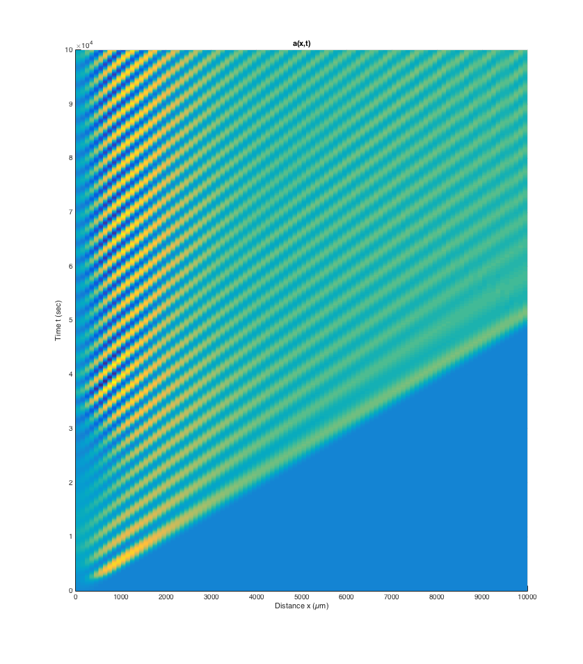
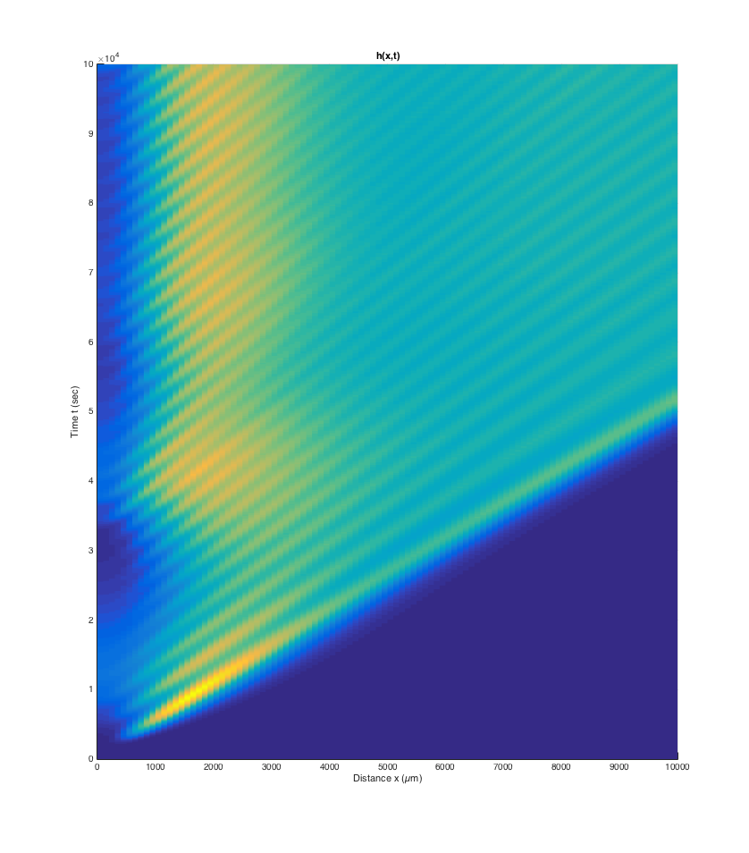

# root-growth-matlab

## What is this?

This repository hosts a MATLAB simulation of a system of PDEs describing
oscillatory behavior in the Arabidopsis root, which underlies the formation of
lateral root primordia.

This project is being developed as part of a research project at Duke
University's [Benfey Laboratory](http://sites.duke.edu/benfey/).

*Note:* I've tested the MATLAB codes in this repository only on MATLAB R2015a
on OS X Yosemite.

## Research background

Below I'm going to provide a summary of what we're trying to simulate, *from a
software engineer's perspective*.
Please keep in mind I'm not a biologist/physicist/mathematician at all.
I just produce software at the lab's request.
I don't know the biological/physical/mathematical details behind what I explain
below.
Please consult the lab for such details.

We are trying to simulate cell growth and diffusion of certain chemicals across
a plant root.

Imagine a long one-dimensional vertical column of a certain fixed height.
This is our "root".

The very first moment our simulation begins, the topmost region of the root
contains a predefined amount of a chemical substance called the *activator*
substance.
This substance is a liquid.
Everywhere else, there is none of this substance.

What's interesting about this liquid is that the mere presence of it anywhere
in the root soon gives rise to a substance called the *inhibitor* substance at
that point.
The *inhibitor* substance is also a liquid.
The interaction between these two substances does not stop here.
It's quite complex:
- The concentration of the activator promotes a rise in the concentration of
the inhibitor.
- The activator promotes a rise in its own concentration in a polynomial order
of 2.
- The activator promotes a decay in its own concentration in a polynomial order
of 1.
- The inhibitor promotes a decay in the activator.
- The inhibitor promotes a rise in its own concentration in a polynomial order
of 2.
- The activator promotes a decay in its own concentration in a polynomial order
of 1.
- Since both substances are liquids, it diffuses to the rest of the root.

To make the model more complex, here's a new fact: the root keeps growing at a
predefined speed.
Now, it grows from the *bottom*, not the top.
That is, the topmost region will always remain the topmost region.

Furthermore, at every moment, at every position, a new amount of the activator
is being constantly created (but not the activator).

To explain all these phenomena mathematically, we have come up with the
following system of partial differential equations, which is a variation of one
found in [Meinhardt 2008](http://www.ncbi.nlm.nih.gov/pubmed/18023723).

Explanation of the variables/constants:
- Let's make sure you and I both agree on a coordinate system in this math here.
Coordinate `x = 0` means the bottom end of the topmost region that contained an
initial activator concentration.
So, if the height of the region is 200, `x = 200` points to the top end of the
root.
This coordination makes sense, because anything below the topmost part is
initially uninteresting.
The parts below the topmost region contain no initial concentration of anything.
They only become interesting after the substances diffuse down from the topmost
region.
Unit is `µm`.
- `t` represents the time elapsed since the beginning of the simulaltion.
Unit is `sec`.
- `a(x,t)` is the function of activator concentrations.
Unit is `co`.
**Note:** `co` is an imaginary unit of concentration that I've made up.
- `h(x,t)` is the function of activator concentrations.
Unit is `co`.
- `rho_a` is what's called the *activator source density* according to
[Meinhardt 2008](http://www.ncbi.nlm.nih.gov/pubmed/18023723).
Unit is `/sec`.
- `h_0` is what I call the *activator denominator default*.
It is particularly useful when `h = 0`, because without this default term, we
would be dividing by zero.
Unit is `co`.
- `mu` is what I call the *activator decay coefficient*.
Unit is `/sec`.
- `D_a` is what I call the *activator diffusion coefficient*.
Unit is `µm^2/sec`.
- `s` is what I call the *drift velocity*.
This is the speed at which the root grows.
This whole term involving `da/dx` simulates the upward movement of every
position in the root, as the root grows from the bottom.
- `c` is what I call the *activator base production rate*.
At every moment, at every position, a new amount of the activator is being
created.
Unit is `co/sec`.
- `rho_h` is the *inhibitor source density*.
Unit is `/co/sec`.
- `nu` is what I call the *inhibitor decay coefficient*.
Unit is `/sec`.
- `D_h` is what I call the *inhibitor diffusion coefficient*.
Unit is `µm^2/sec`.

Also, since this is a system of PDEs, we need boundary conditions.
Let's assume for now `da/dx = dh/dx = 0` at both the top end and the bottom end
of the root.

As for initial conditions, we already discussed what they should be: `0 <= x <=
200` (200 for example) initially has some activator concentration and no
inhibitor concentration.
Everywhere else initially has none of either.

To make better sense of this system of PDEs, let's simulate them.
If you look to the right side of the main page of this repository (which you're
likely on right now), there is a `Download ZIP` button.
Unzip, go to the directory `src`, and run `main.m`.
This file runs simulation of our system of PDEs using MATLAB's built-in PDE
solver.

The constant values used in the source code were obtained after many trials and
errors.
They are not necessarily values that would make sense in the physical world.
Right now they're tuned so that the final results of the simulation make sense.
The following two sources were also consulted:
- [Meinhardt
1972](http://jxshix.people.wm.edu/2009-harbin-course/classic/gierer-meinhardt-1972.pdf)
- [Meinhardt's BASIC source code simulating similar
PDEs](http://www.eb.tuebingen.mpg.de/research/emeriti/hans-meinhardt/biuprog.html)

Orient the resulting 3D graphs so that you're looking down on them from the sky
(from `z = ∞`).
Do you see how the diagonal stripes form?

Let's digest this result for a moment.
At a fixed time `t`, we're seeing peaks of concentrations across the root, at a
quite uniform interval.
And the diagonal shifting of each of these peaks occurs because the root grows
*from the bottom*.

## Research focus

We are interested in seeing how tightly the diagonals come together as we vary
the drift velocity (i.e. the rate of root height growth).
Physical experiments at the lab have shown that the time interval between each
diagonal remains the same regardless of the drift velocity.

Below are the simulations of activator concentrations at varying velocities:
`0.05`, `0.1`, `0.2`.
I will not make any comments.

